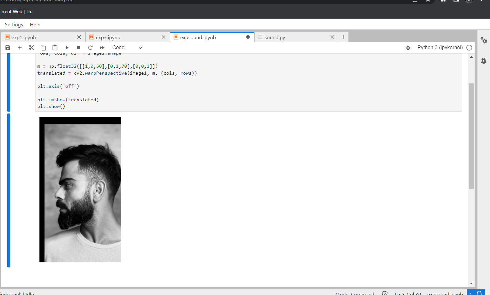
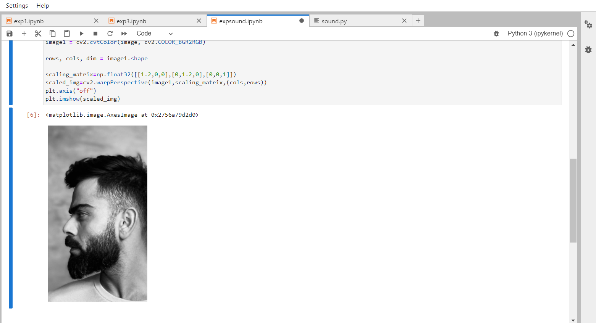
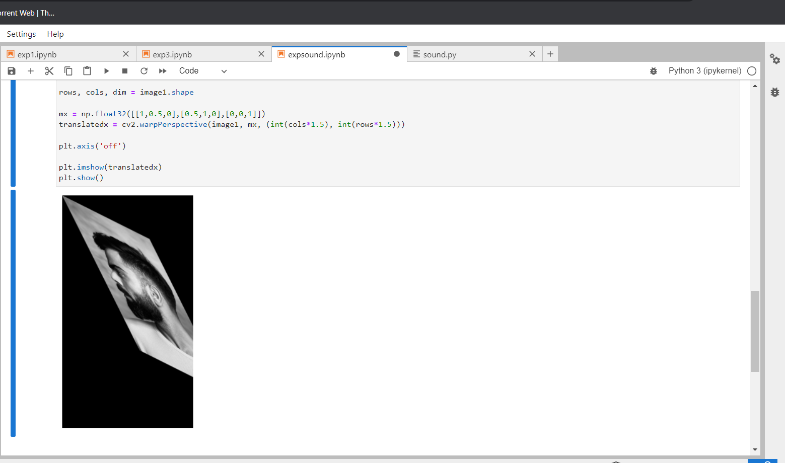
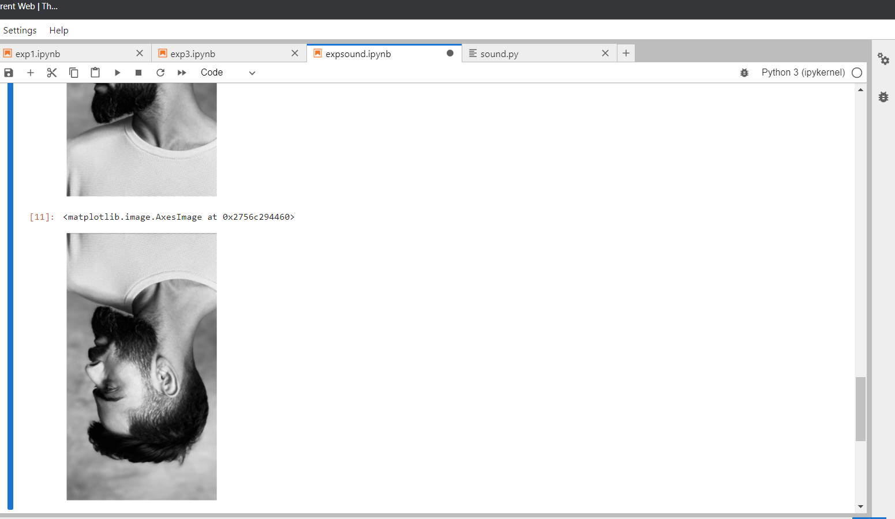

# Image-Transformation
## Aim
To perform image transformation such as Translation, Scaling, Shearing, Reflection, Rotation and Cropping using OpenCV and Python.

## Software Required:
Anaconda - Python 3.7

## Algorithm:
### Step1:
Import the necessary libraries and read the original image and save it a image variable

### Step2:
Translate the image using
Translation_matrix=np.float32([[1,0,120],[0,1,120],[0,0,1]]) Translated_image=cv2.warpPerspective(org_img,Translation_matrix,(col,row))

### Step3:
Scale the image using
Scaling_Matrix=np.float32([[1.2,0,0],[0,1.2,0],[0,0,1]])
Scaled_image=cv2.warpPerspective(org_img,Scaling_Matrix,(col,row))

### Step4:
Shear the image using
Shearing_matrix=np.float32([[1,0.2,0],[0.2,1,0],[0,0,1]])
Sheared_image=cv2.warpPerspective(org_img,Shearing_matrix,(col2,int(row1.5)))

### Step5:
Reflection of image can be achieved through the code
Reflection_matrix_row=np.float32([[1,0,0],[0,-1,row],[0,0,1]])
Reflected_image_row=cv2.warpPerspective(org_img,Reflection_matrix_row,(col,int(row)))

## Program:
```
Developed By: Soundariyan M N 
Register Number: 212222230146
```
i)Image Translation
```python
import numpy as np
import cv2
import matplotlib.pyplot as plt

image = cv2.imread('virat1.jpg')
image1 = cv2.cvtColor(image, cv2.COLOR_BGR2RGB)
rows, cols, dim = image1.shape

m = np.float32([[1,0,50],[0,1,70],[0,0,1]])
translated = cv2.warpPerspective(image1, m, (cols, rows))

plt.axis('off')

plt.imshow(translated)
plt.show()
```


ii) Image Scaling
```python
import numpy as np
import cv2
import matplotlib.pyplot as plt

image = cv2.imread('virat1.jpg')
image1 = cv2.cvtColor(image, cv2.COLOR_BGR2RGB)

rows, cols, dim = image1.shape

scaling_matrix=np.float32([[1.2,0,0],[0,1.2,0],[0,0,1]])
scaled_img=cv2.warpPerspective(image1,scaling_matrix,(cols,rows))
plt.axis("off")
plt.imshow(scaled_img)
```


iii)Image shearing
```python
import numpy as np
import cv2
import matplotlib.pyplot as plt

image = cv2.imread('virat1.jpg')
image1 = cv2.cvtColor(image, cv2.COLOR_BGR2RGB)

rows, cols, dim = image1.shape

mx = np.float32([[1,0.5,0],[0.5,1,0],[0,0,1]])
translatedx = cv2.warpPerspective(image1, mx, (int(cols*1.5), int(rows*1.5)))

plt.axis('off')

plt.imshow(translatedx)
plt.show()
```


iv)Image Reflection
```python
import numpy as np
import cv2
import matplotlib.pyplot as plt

image = cv2.imread('virat1.jpg')
image1 = cv2.cvtColor(image, cv2.COLOR_BGR2RGB)
rows, cols, dim = image1.shape

plt.axis('off')
plt.imshow(image)
plt.show()


reflection_matrix_col=np.float32([[-1,0,cols],[0,1,0],[0,0,1]])
reflected_img_col=cv2.warpPerspective(image,reflection_matrix_col,(cols,int(rows)))
plt.axis("off")
plt.imshow(reflected_img_col)
reflection_matrix_row=np.float32([[1,0,0],[0,-1,rows],[0,0,1]])
reflected_img_row=cv2.warpPerspective(image,reflection_matrix_row,(cols,int(rows)))
plt.axis("off")
plt.imshow(reflected_img_row)
```


v)Image Rotation
```python
import numpy as np
import cv2
import matplotlib.pyplot as plt

image = cv2.imread('virat1.jpg')
image1 = cv2.cvtColor(image, cv2.COLOR_BGR2RGB)
rows, cols, dim = image1.shape
angle = np.radians(10)

mx = np.float32([[np.cos(angle),-(np.sin(angle)),0],[np.sin(angle),np.cos(angle),0],[0,0,1]])

translatedx = cv2.warpPerspective(image1, mx, (int(cols), int(rows)))

plt.axis('off')

plt.imshow(translatedx)
plt.show()
```


## Output:
### i)Image Translation


### ii) Image Scaling



### iii)Image shearing


### iv)Image Reflection



### v)Image Rotation


## Result: 

Thus the different image transformations such as Translation, Scaling, Shearing, Reflection, Rotation and Cropping are done using OpenCV and python programming.
